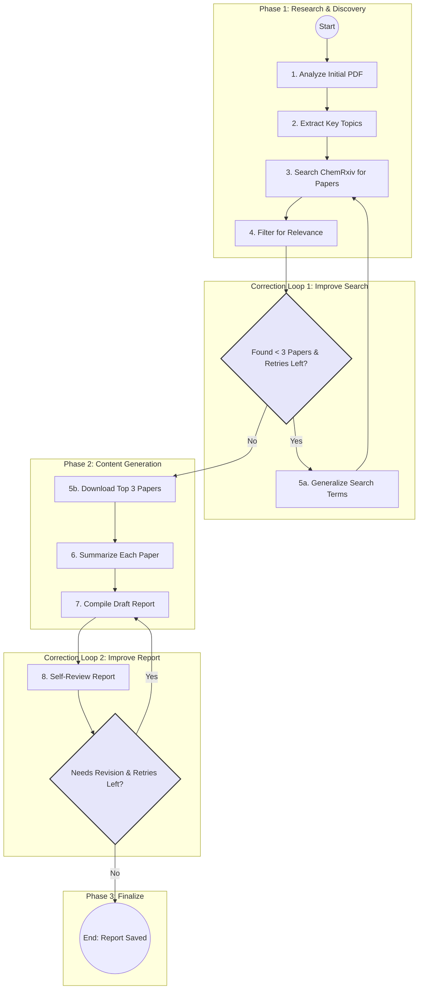

# chemrxiv_agentic_review
OVERVIEW
--------------------------------------
This project demonstrates a sophisticated, multi-step agentic system built with LangChain and LangGraph. The agentic system primary goal is to autonomously create a literature review report based on search results in ChemrXiv API endpoints, from the metadata of a scientific paper (in PDF format).

The system is designed to be environment-agnostic, capable of running with a local Large Language Model (LLM) for development and testing, or seamlessly switching to a managed model endpoint on Azure AI Foundry for a scalable, cloud-native demonstration.

This serves as a powerful demo of how agentic principles—such as tool use, state management, and self-correction—can be orchestrated to perform complex, knowledge-based tasks.


CORE FUNCTIONALITIES
--------------------------------------
The agent executes the following workflow autonomously:

1.  **Initial Analysis**: Ingests a starting PDF and extracts the text from its first page to understand the core topic.

2.  **Topic Extraction**: Uses an LLM to identify the most important key terms or topics from the initial text.

3.  **Literature Search**: Queries the ChemRxiv API using the extracted key terms to find recent, relevant scientific papers.

4.  **Relevance Filtering**: Employs the LLM to review the title and abstract of each search result to determine if it is relevant to the initial topics.

5.  **Intelligent Retry**: If the initial search yields too few relevant papers, the agent uses the LLM to generate broader, more general search terms and retries the search process.

6.  **Paper Acquisition**: Downloads the PDFs of the top 3 most relevant papers into a local 'downloads' directory.

7.  **Summarization**: Reads the full text of each downloaded paper, intelligently strips the references/bibliography, and uses the LLM to generate a comprehensive summary of its key findings, methods, and conclusions.

8.  **Report Compilation**: Assembles a structured report in Markdown format (`final_report.md`) that includes:
    *   An LLM-generated Introduction, Analysis, and Conclusion synthesizing the findings from all papers.
    *   The initial paper's extracted information.
    *   The detailed summaries of each related paper.

9.  **Self-Correction & Review**: Performs a review of its own generated report against quality criteria (structure, length). If the report is not satisfactory, it enters a revision loop to improve it based on the self-generated feedback.


KEY CAPABILITIES DEMONSTRATED
--------------------------------------
*   **Agentic Systems**: A complete, stateful agent that reasons, plans, and executes a multi-step task.
*   **Tool Use**: The agent leverages a variety of tools, including a PDF reader, a scientific paper search API (ChemRxiv), a file downloader, and a file writer.
*   **LLM as a Reasoning Engine**: The LLM is used not just for content generation but for decision-making tasks like term extraction, relevance filtering, and report review.
*   **Resilience and Logic**: The workflow includes conditional edges (e.g., retrying a search with new terms), making the agent more robust.
*   **Self-Improvement**: The compile-review-revise loop is a basic but powerful example of an agent attempting to improve its own output.
*   **Cloud-Ready Design**: The code is structured with a simple flag (`USE_AZURE`) to switch between a local LLM and a production-grade Azure OpenAI model endpoint, demonstrating the path from prototype to cloud deployment.

---

## The Agentic Workflow: A Step-by-Step Breakdown

The agent operates as an autonomous research assistant, following a structured yet dynamic workflow to move from a single source paper to a complete literature review. The entire process is orchestrated by a state machine (using LangGraph) and can be visualized in three main phases, enhanced by two intelligent self-correction loops.

### Phase 1: Research & Discovery

This initial phase is focused on understanding the core topic and gathering relevant source material.

1.  **Initial Ingestion & Analysis**: The workflow begins when the agent is provided with a single starting PDF. It reads the first page of this document to establish a foundational understanding of the subject matter.

2.  **Key Topic Extraction**: Using a Large Language Model (LLM), the agent identifies the most critical scientific topics or keywords from the initial text. These terms will guide its subsequent research. 

3.  **Literature Search**: The agent queries the ChemRxiv API—a repository for chemistry preprints—using the extracted key topics to find recent and related scientific articles.

4.  **Intelligent Filtering**: Raw search results are often noisy. The agent reviews the title and abstract of each paper found and uses the LLM to make a judgment call: is this paper truly relevant to the core topics? Only the most relevant papers are passed to the next stage.

### Phase 2: Content Generation & Synthesis

With relevant papers identified, the agent transitions from researcher to author.

5.  **Paper Acquisition**: The agent downloads the full PDF documents for the top most relevant papers, saving them to a local `downloads/` directory.

6.  **In-Depth Summarization**: For each downloaded paper, the agent performs a deep read. It extracts the full text, intelligently removes the bibliography/references section to avoid confusion, and then uses the LLM to write a comprehensive summary covering the paper's methods, findings, and conclusions.

7.  **Report Synthesis**: This is the core creative step. The agent assembles a draft literature review in a structured Markdown file. It doesn't just combine the summaries; it prompts the LLM to write a high-level **Introduction**, **Analysis**, and **Conclusion** that synthesizes the information from all papers, identifying common themes and the overall narrative.

### Phase 3: Review & Finalization

Before finishing, the agent critically assesses its own work to ensure quality.

8.  **Self-Correction & Review**: The agent reviews the generated `final_report.md` against a set of quality criteria (e.g., proper structure, sufficient length, and clear sections). This is a crucial step where the agent evaluates its own output.

9.  **Finalization**: If the report passes the self-review (or has reached its revision limit), the workflow concludes. The final report is saved, and the downloaded papers are available for inspection.

---

### Intelligent Self-Correction Loops

A key feature of this agentic system is its ability to adapt when a step doesn't produce the desired outcome. This is handled by two powerful loops:

**1. The Search Refinement Loop**
*   **Trigger**: This loop activates if the "Intelligent Filtering" step (Phase 1, Step 4) results in fewer than three relevant papers.
*   **Action**: The agent concludes its initial search terms were too narrow. It uses the LLM to brainstorm and generate two new, broader, and more general search terms related to the original topics.
*   **Outcome**: The agent re-initiates the search using these improved terms, dynamically adapting its strategy to increase the probability of finding relevant material.

**2. The Report Revision Loop**
*   **Trigger**: This loop activates if the "Self-Correction & Review" step (Phase 3, Step 8) determines the draft report is not satisfactory.
*   **Action**: The agent takes the generated feedback (e.g., "The analysis section is too short") and re-runs the "Report Synthesis" step. The LLM is now prompted not only to write the report but to revise it specifically according to the feedback.
*   **Outcome**: A new, improved version of the report is generated. This loop can run multiple times, allowing the agent to iteratively refine its own writing.

### Workflow Diagram

To visualize this flow, including the decision points and loops, see the diagram below.

<details>
<summary><b>Click to expand the workflow diagram</b></summary>



</details>


SYSTEM REQUIREMENTS
--------------------------------------
*   Python 3.9+
*   An LLM endpoint (either a local server like Ollama/LM Studio or an Azure AI Foundry deployment).
*   Required Python packages as listed in `requirements.txt`.


HOW TO RUN
--------------------------------------

**1. Create a `requirements.txt` file with the following content:**  

* langchain
* langchain-openai
* langgraph
* python-dotenv
* chemrxiv
* pymupdf4llm


    
**2. Local Execution (Using a Local LLM Server)**

This mode is ideal for development and testing without incurring cloud costs.

*   **Step 1: Clone the Repository**
   ```
    git clone https://github.com/hamletlg/chemrxiv_agentic_review
    cd chemrxiv_agentic_review
   ```

*   **Step 2: Install Dependencies**
   ```
    pip install -r requirements.txt
   ```

*   **Step 3: Start Your Local LLM Server**
    Ensure your local LLM server (e.g., Ollama, LM Studio) is running and accessible at `http://localhost:1234/v1`.

*   **Step 4: Configure the Script**
    In agent_workflow.py, set the configuration flag to `False`:
    ```
    USE_AZURE = False
    ```

*   **Step 5: Run the Agent**
    Place your starting PDF (e.g., `10.26434_chemrxiv-2025-5qdpp.pdf`) in the root directory and run the script:
    ```
    python agent_workflow.py
    ```

**3. Cloud Execution (Deploying to Azure AI Foundry)**

This demonstrates the agent's capacity to run in a scalable, managed cloud environment.

*   **Step 1: Prerequisites**
    - An active Azure Subscription.
    - An Azure AI resource, specifically an Azure OpenAI resource, created in your subscription.
    - A model (e.g., gpt-4, gpt-35-turbo) deployed within your Azure OpenAI resource. You will need its "Deployment Name".

*   **Step 2: Local Configuration**
    - Clone the repository as described above.
    - In the project's root directory, create a file named `.env`.
    - Add your Azure credentials to this file. It should look like this:

      ```
      AZURE_OPENAI_API_KEY="your_azure_openai_api_key"
      AZURE_OPENAI_ENDPOINT="httpsa://your-resource-name.openai.azure.com/"
      AZURE_OPENAI_DEPLOYMENT_NAME="your-model-deployment-name"
      AZURE_OPENAI_API_VERSION="2024-02-01"
      ```

*   **Step 3: Configure the Script for Azure**
     In `agent_workflow.py`, set the configuration flag to `True`:
      `USE_AZURE = True`

*   **Step 4: Deploy and Run in Azure Machine Learning**   

    1.  **Navigate to Azure ML Studio**: Go to `ml.azure.com` and select your workspace.
    2.  **Upload Project Files**: In the "Notebooks" section, use the "Upload folder" button to upload the entire project directory (including `agent_workflow.py`, your starting PDF, and the `.env` file).
    3.  **Create a Compute Instance**: In the "Compute" section, create a new "Compute instance". Wait for it to be created and running.
    4.  **Open Terminal**: In the "Notebooks" section, with your compute instance running, open the Terminal.
    5.  **Install Dependencies in Azure**: In the terminal, navigate to your project directory and install the required packages on the compute instance:
        `pip install -r requirements.txt`
    6.  **Execute the Agent**: Run the script from the terminal. The script will automatically load the credentials from your `.env` file and connect to your Azure AI model.
        `python agent_workflow.py`

*   **Step 5: Check the Output**
    The script will print its progress to the terminal. Once complete, you can find the generated `final_report.md` and the `downloads` directory within your project folder in the Azure ML Notebooks file browser.


FUTURE IMPROVEMENTS & CLOUD-NATIVE ENHANCEMENTS
--------------------------------------
*   **Azure AI Document Intelligence**: The script currently uses `pymupdf4llm` for PDF text extraction. For superior accuracy, especially with complex layouts and tables, the PDF extraction tools can be upgraded to use the Azure AI Document Intelligence service. The code is already annotated where this change would be made.
*   **Azure Blob Storage**: Instead of downloading papers to the local filesystem of the compute instance, a more robust solution would be to use a tool that saves them to an Azure Blob Storage container.
*   **Managed Identity**: For production scenarios, authentication should be handled via Azure Managed Identities instead of storing API keys in a `.env` file.

  
